# 🌊 OCEANIX — Premium Home Organisation & Kitchen Store

> **Good Quality & Affordable Home Organization, Kitchen & Home Essentials**
>
> OCEANIX is a full-featured, production-ready Django e-commerce platform for premium home organisation and kitchen essentials. It features a modern blue-themed storefront, complex customer account workflows (subscriptions, wishlists, address books), a seller panel, and a dedicated Super Admin Console with inline inventory management, order tracking, and printable PDF/tax invoices.

---

## 🎨 Visual Showcase & Screenshot Gallery

Here is a complete tour of the OCEANIX application interface, demonstrating the user journey from storefront to customer account panel, and backend management console:

### 🛒 Storefront & Customer Flow
| View | Description | Screenshot |
| --- | --- | --- |
| **01. Storefront Home** | The landing page featuring a premium blue-themed UI, announcement bar, category tabs, and product cards with dynamic discount/out-of-stock badges. | 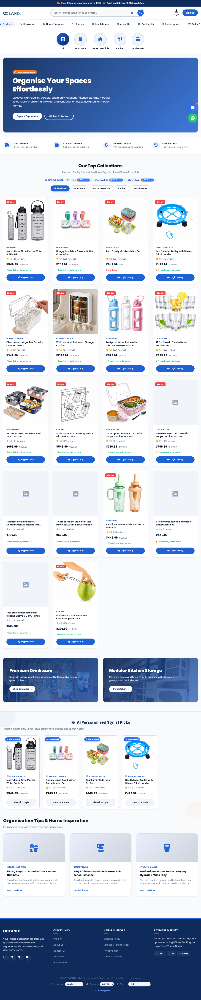 |
| **02. Customer Login** | Sleek, secure customer login page with validation. | 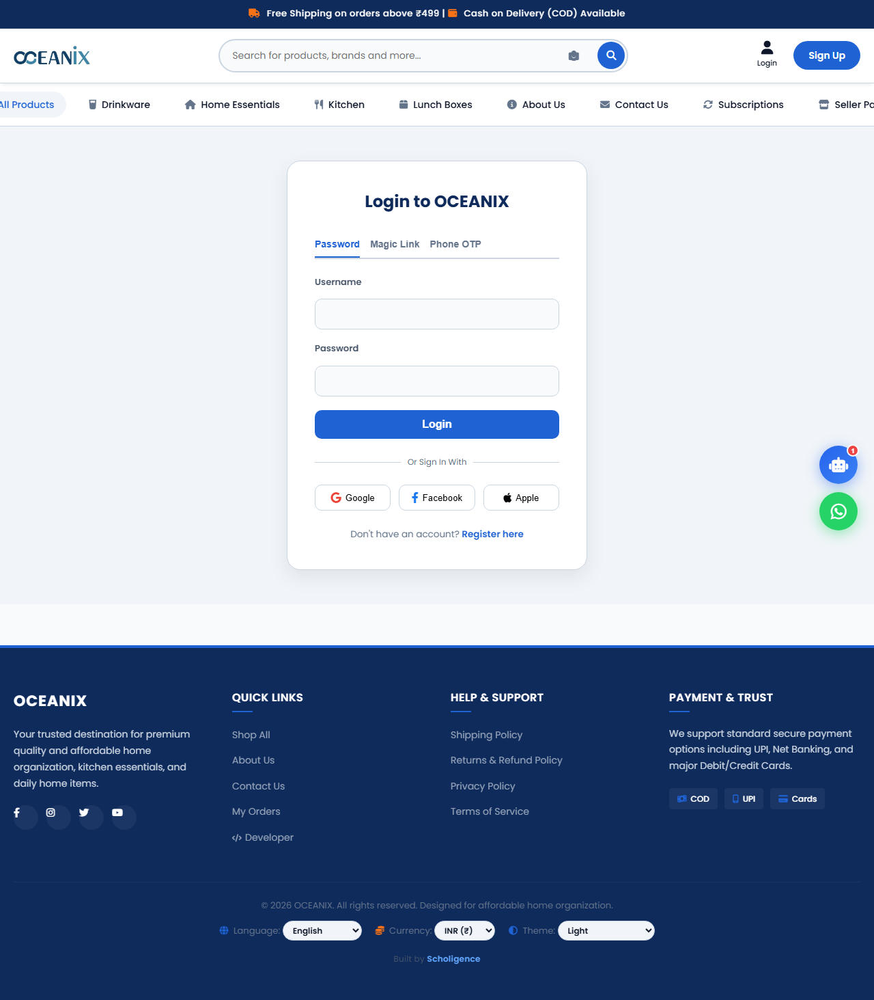 |
| **03. Customer Registration** | Clean sign-up form for new customers. | 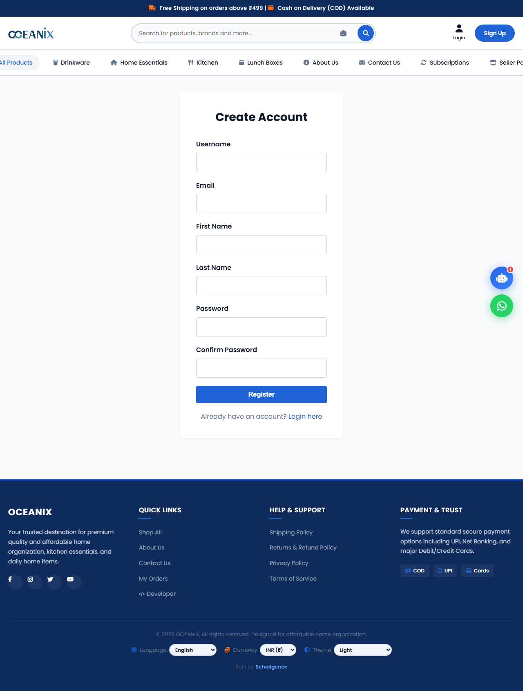 |
| **04. Product Detail Page** | Immersive product page showing details, specifications, real-time stock levels, dynamic ratings, and reviews. | 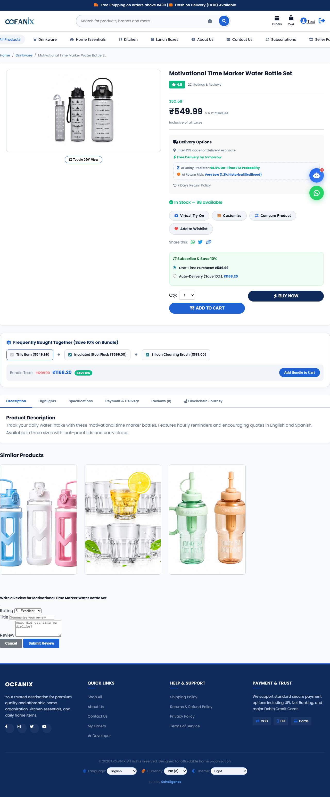 |
| **05. Shopping Cart** | Interactive cart showing item summaries, subtotal calculations, and item modification/removal. | 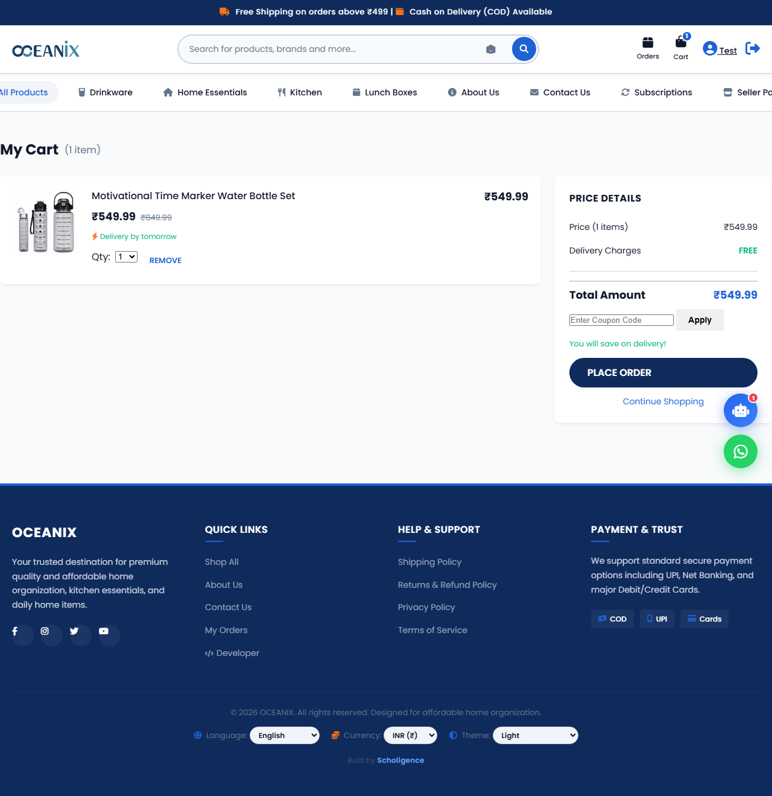 |
| **06. Checkout Flow** | Comprehensive checkout with address selection, B2B company tax/GSTIN details, and multiple payment methods. | 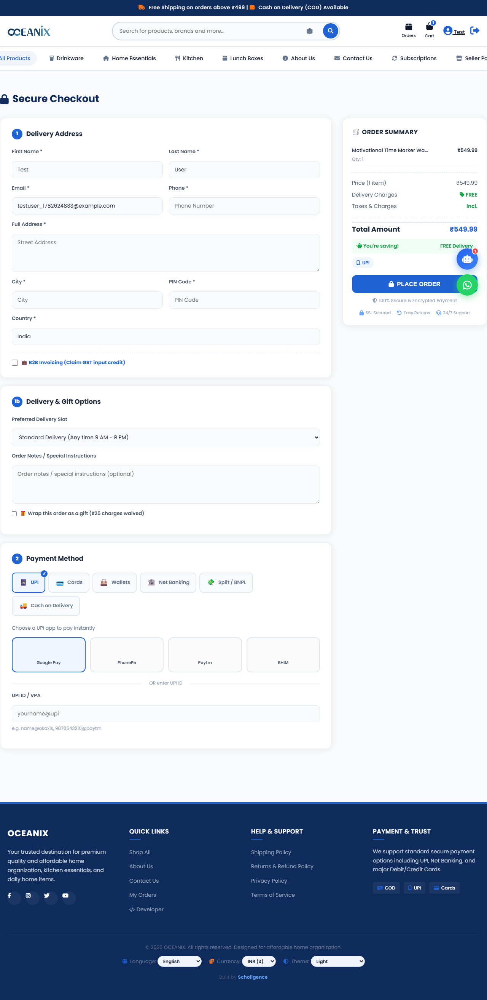 |
| **07. Order Confirmation** | Successful order placement summary with a timeline tracker. | 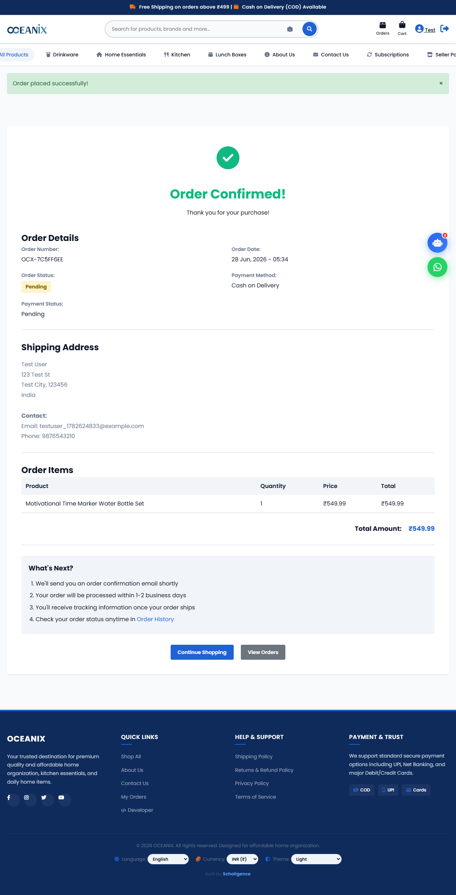 |

### 👤 Customer Account Panel
| View | Description | Screenshot |
| --- | --- | --- |
| **08. User Dashboard** | Overview of customer orders, active subscriptions, and profile shortcuts. | 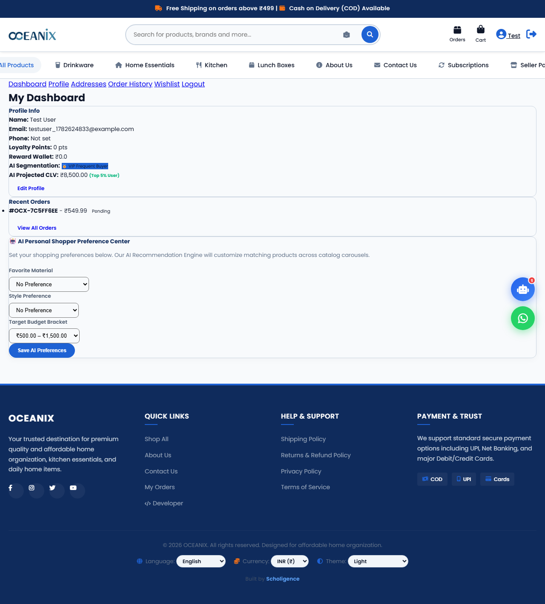 |
| **09. Profile Management** | Form to edit personal profile info and account preferences. | 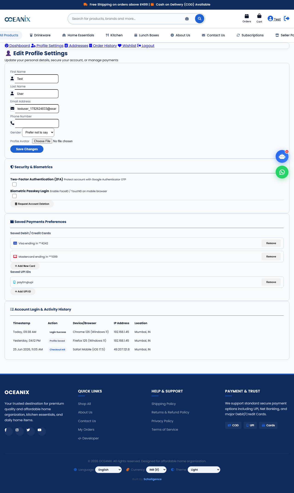 |
| **10. Saved Addresses** | Management portal for customer delivery and billing addresses. | 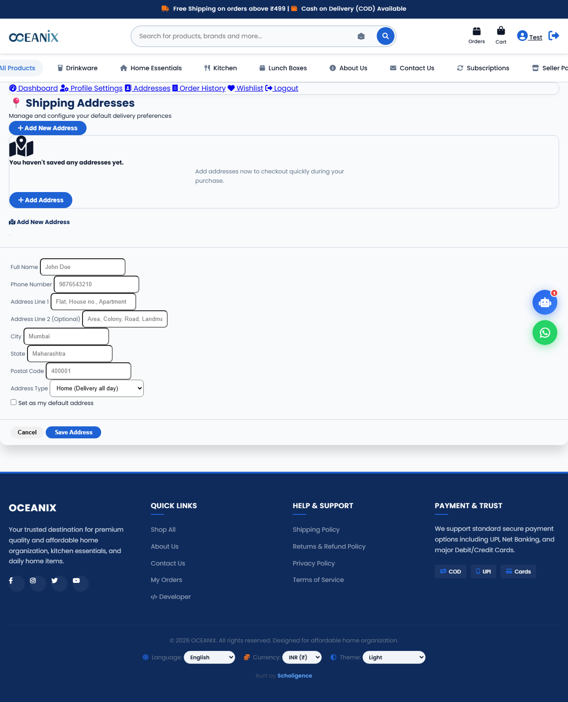 |
| **11. Personal Wishlist** | Saved items page showing favorited products with direct add-to-cart actions. | 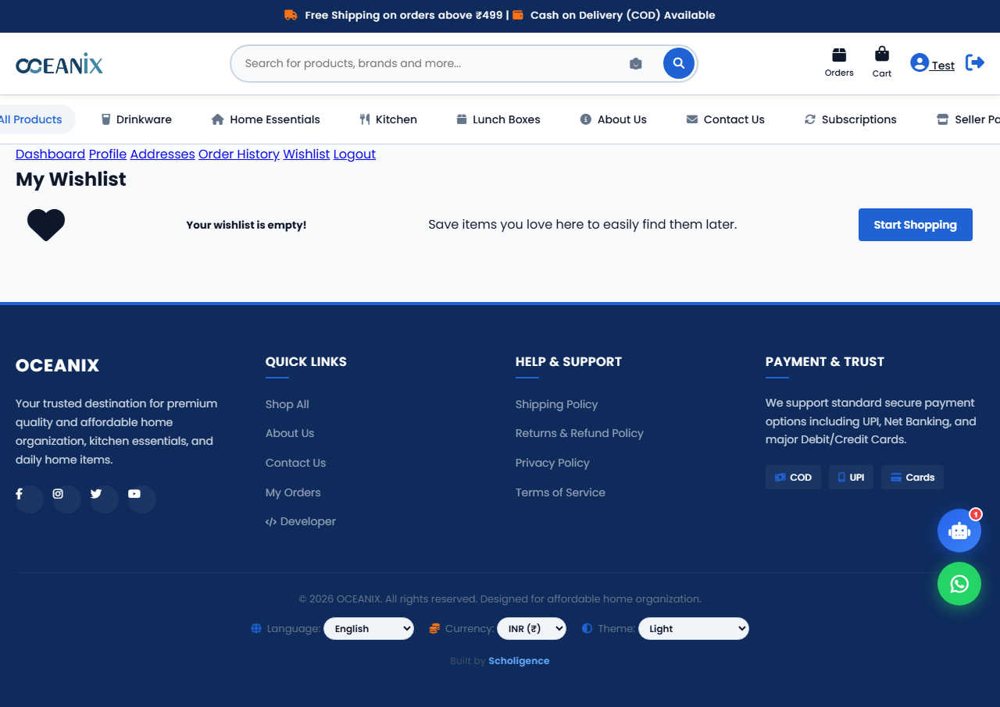 |
| **12. Subscriptions Dashboard** | Automated scheduling console enabling daily, weekly, or monthly deliveries of recurring items (e.g. pantry, dairy). | 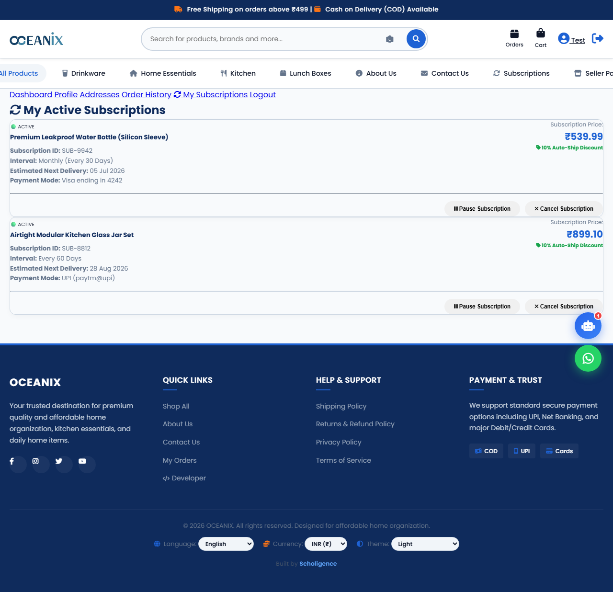 |

### 🛠️ Seller & Admin Portal
| View | Description | Screenshot |
| --- | --- | --- |
| **13. Seller Panel** | A dedicated panel for vendors to monitor vendor-specific products, review pending customer order list, and view earnings. | 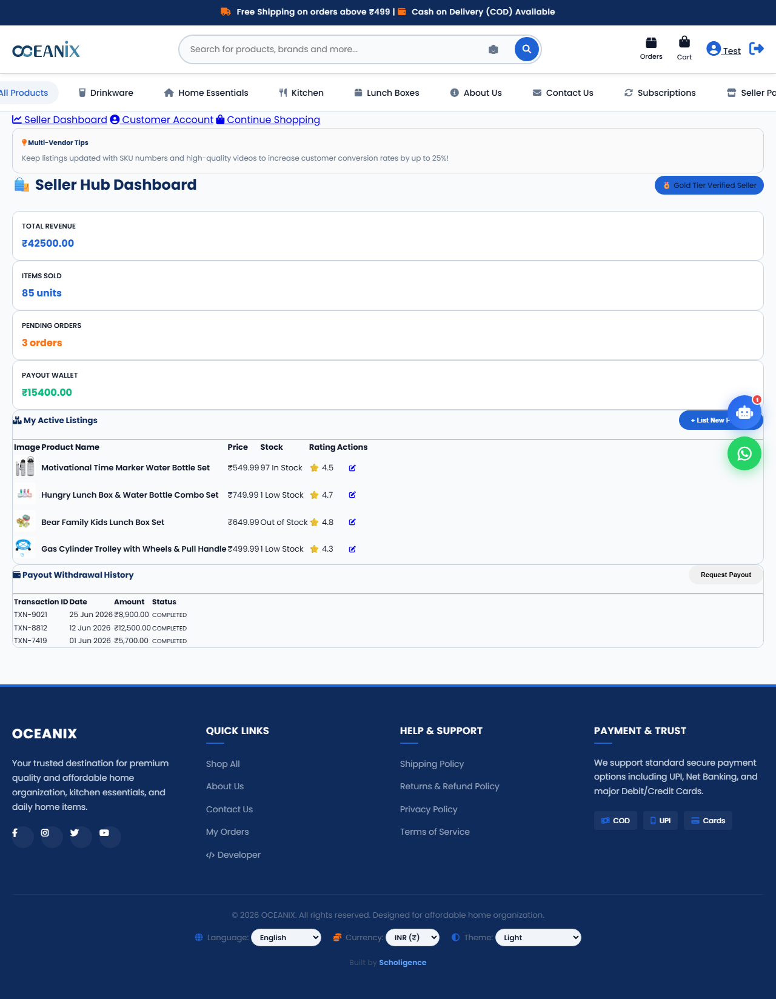 |
| **14. Admin Dashboard** | High-level metrics view displaying Total Orders, Total Revenue, Pending Orders, and Total Products in Hand (stock aggregation). |  |
| **15. Inventory Console** | Interactive inventory manager supporting inline stock/price updates and quick adjustments (+5, +10, -1, Out-of-Stock). | 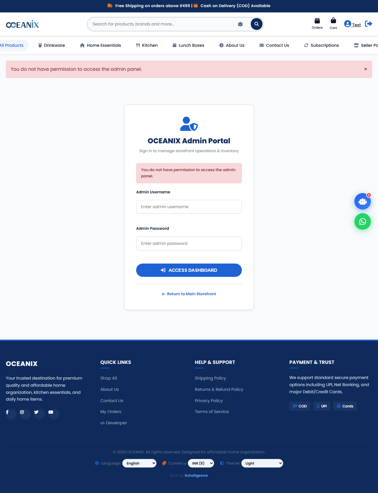 |
| **16. Admin Orders Management**| Track, filter, update statuses of customer purchases, and print out-of-box tax bills/invoices. |  |

---

## ✨ Features Breakdown

### 🛍️ Customer Experience
- **Premium Blue-Themed UI:** Highly-responsive storefront designed with CSS glassmorphism, tailored gradients, and premium typography (Inter font).
- **Dynamic Category Filter:** Seamless product filtering across home categories.
- **Advanced Wishlist & Cart:** Real-time adding, removing, and state management of items.
- **B2B Billing Support:** Customers can tick a checkbox at checkout to input company details, name, and **GSTIN** for professional tax invoicing.
- **Subscription Engine:** Schedule product deliveries on a recurring daily, weekly, or monthly interval.
- **Address Book:** Save multiple addresses and select one dynamically during checkout.

### 💼 Seller & Admin Capabilities
- **Seller Panel (`/seller/panel/`):** Independent portal for merchant partners to view shop stats, list items, and track orders.
- **Admin Dashboard (`/panel/`):** Summary analytics with KPI metrics, order histories, and visual reports.
- **Inline Stock Manager:** One-click inventory modification without reloading pages.
- **Printable Invoices:** Optimized print templates containing shop branding, customer details, tax breakdowns, and order timestamps.

### 💳 Integrations
- **Razorpay Payments:** Online payment portal flow with webhook/signature verification support.
- **Cash on Delivery (COD):** Secure checkout flow for manual/physical collections.

---

## 🚀 Getting Started & Installation

Follow these steps to set up and run the project locally on your machine:

### Prerequisites
- **Python 3.10+**
- **Git**
- **pip** (Python package installer)

### Setup Instructions

1. **Clone the repository:**
   ```bash
   git clone https://github.com/kakkarot23/Learning_Platform.git
   cd Learning_Platform
   ```

2. **Create and activate a virtual environment:**
   * **Windows (PowerShell/CMD):**
     ```bash
     python -m venv venv
     venv\Scripts\activate
     ```
   * **macOS/Linux:**
     ```bash
     python3 -m venv venv
     source venv/bin/activate
     ```

3. **Install the required packages:**
   ```bash
   pip install -r requirements.txt
   ```

4. **Run database migrations:**
   ```bash
   cd oceanix_ecom
   python manage.py migrate
   ```

5. **Load sample database values and admin credentials:**
   ```bash
   # Sets up initial catalog products and auto-creates an admin user
   python manage.py setup_initial_data
   ```

6. **Start the Django development server:**
   ```bash
   python manage.py runserver
   ```

7. **Access the application:**
   - **Storefront:** [http://127.0.0.1:8000/](http://127.0.0.1:8000/)
   - **Admin/Seller Panel:** [http://127.0.0.1:8000/panel/login/](http://127.0.0.1:8000/panel/login/)

---

## 🔐 Default Credentials

| Portal / Role | Username | Password | Access Level |
| --- | --- | --- | --- |
| **Super Admin Panel** | `admin` | `admin` | Full control over inventory, orders, billing, and system settings |
| **Django Admin** | `admin` | `admin` | Standard Django admin access (`/admin/`) |

---

## 📁 Repository Structure

```
Learning_Platform/ (OCEANIX Workspace)
├── docs/                        # Project flowcharts and architecture guides
│   ├── DOCUMENTATION_INDEX.md   # Index of all guides
│   ├── IMPLEMENTATION_GUIDE.md  # Detailed setup steps and architecture
│   └── PROJECT_FLOWCHARTS.md    # Mermaid lifecycle diagrams
├── image/                       # Raw catalog/product mock images
├── product/                     # Text product descriptions and data
├── screenshots/                 # Visual tour screenshots shown in README.md
├── oceanix_ecom/                # Django project root
│   ├── manage.py                # Django CLI utility
│   ├── oceanix_ecom/            # Main project configuration (settings, urls)
│   ├── store/                   # Core application directory
│   │   ├── models.py            # DB schema definitions (Product, Subscription, Wishlist, etc.)
│   │   ├── views.py             # View layers & admin controllers
│   │   ├── urls.py              # URL route mappings
│   │   ├── forms.py             # Forms (User, Admin, checkout registration)
│   │   ├── static/              # CSS stylesheets, Javascript helpers
│   │   └── templates/           # HTML templates (Public pages, user portals, admin dashboard)
│   └── db.sqlite3               # SQLite database
├── .gitignore                   # Ignore specifications (venv, cache, local settings)
└── README.md                    # Main repository documentation
```

---

*Built with ❤️ using Django — OCEANIX © 2026*
