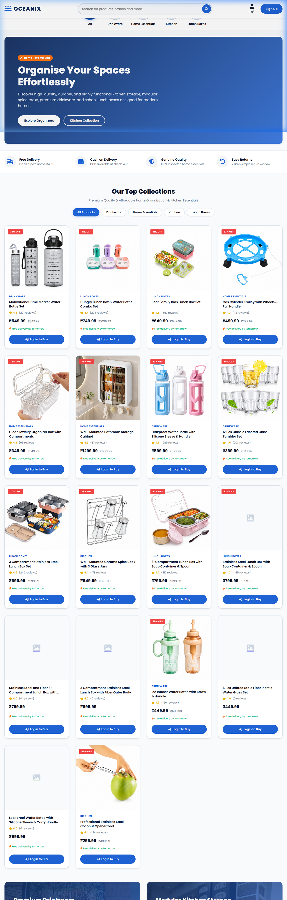
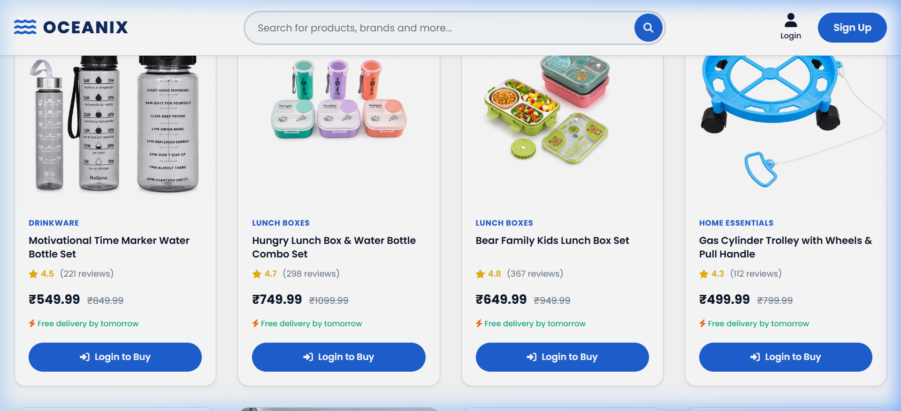
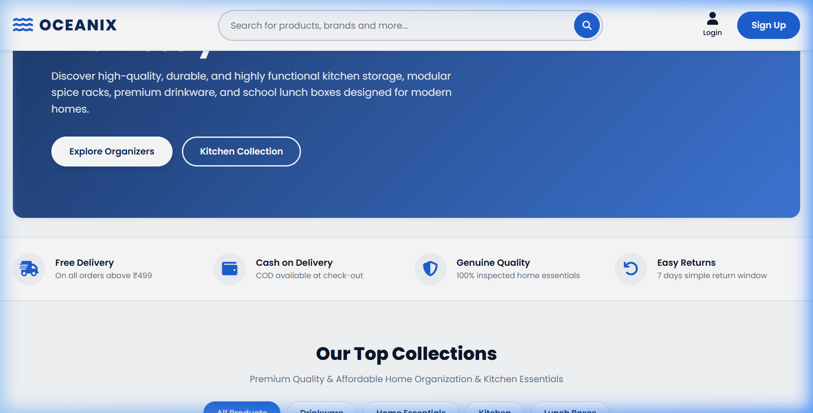
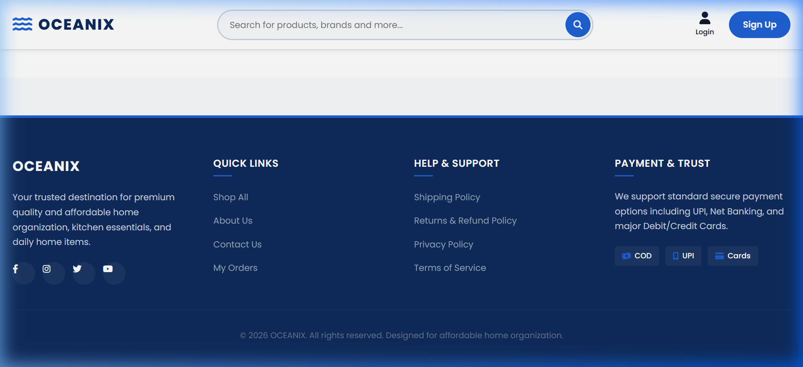
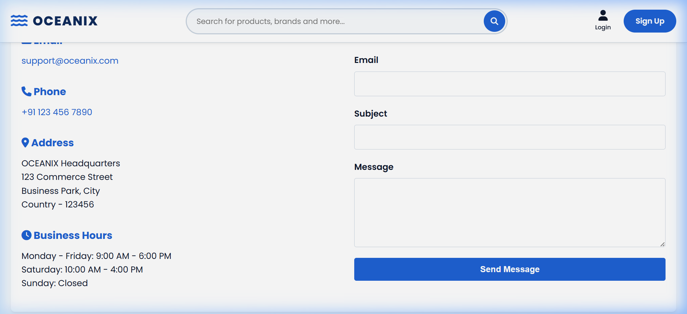
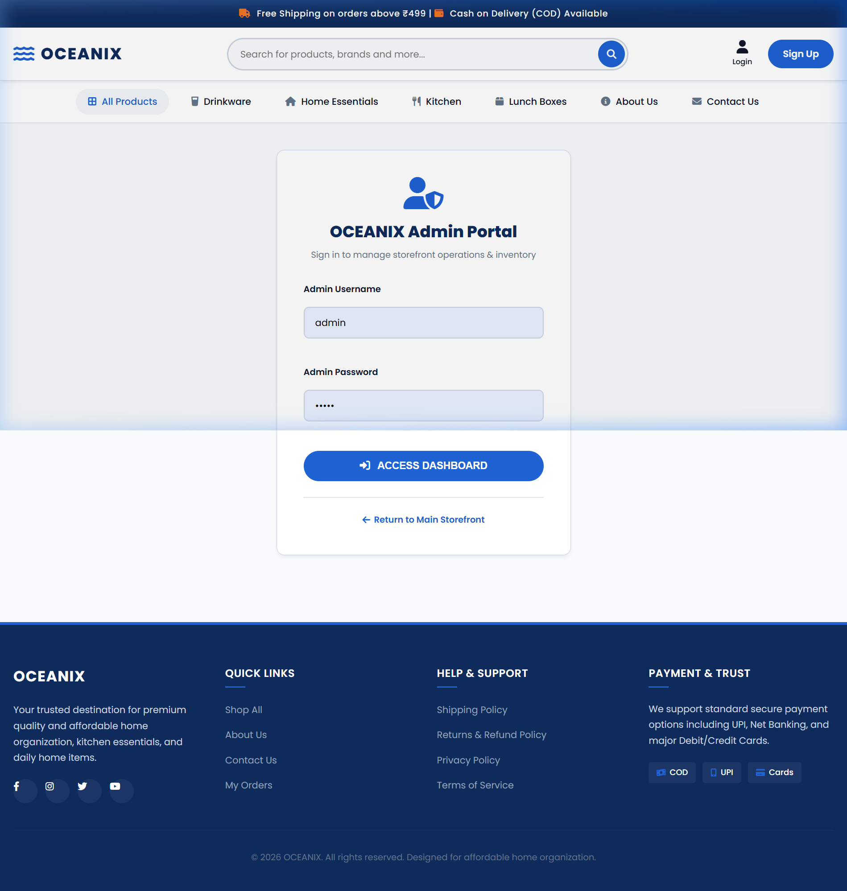

# 🌊 OCEANIX — Premium Home Organisation & Kitchen Store

> **Good Quality & Affordable Home Organization, Kitchen – Home Essentials**

OCEANIX is a full-featured Django e-commerce web application for premium home organisation and kitchen essentials. It features a modern blue-themed storefront, a complete shopping cart & order flow, and a dedicated **Super Admin Panel** with inventory management, order tracking, and printable invoices.

---

## 🖼️ Screenshots

### 🏠 Home / Storefront


### 🔝 Hero Section & Category Filters


### 📄 Homepage (scrolled)


### ℹ️ About Page


### 📞 Contact Page


### 🔐 Admin Login Portal


---

## ✨ Features

### 🛒 Storefront
- Modern, premium blue-themed UI inspired by leading home-goods retailers
- Responsive header with announcement bar, search, login/signup
- Category filter tabs (Drinkware, Home Essentials, Kitchen, Lunch Boxes)
- Product cards with discount badges, star ratings, pricing, and delivery info
- Out-of-Stock indicators — automatically shown when stock reaches 0
- Cart & checkout with Cash on Delivery (COD) support

### 🔑 Super Admin Panel (`/panel/`)
| Feature | URL |
|---|---|
| Admin Login | `/panel/login/` |
| Dashboard | `/panel/` |
| Order List | `/panel/orders/` |
| Order Detail | `/panel/orders/<id>/` |
| Printable Invoice | `/panel/orders/<id>/bill/` |
| Inventory Management | `/panel/inventory/` |

- **Separate Admin Login** — Navigate to `/panel/login/` and log in with `admin` / `admin`
- **Dashboard** — Summary cards: Total Orders, Total Revenue, Pending Orders, **Total Products in Hand** (stock aggregation)
- **Inventory Management** — Inline stock and price editing; quick-adjust buttons (+5, +10, −1, Out of Stock)
- **Order Management** — View all orders, update statuses, filter by date/status
- **Printable Invoice** — Print-optimised bill format with customer details, itemised list, totals, and tax

---

## 🚀 Getting Started

### Prerequisites
- Python 3.10+
- pip

### Installation

```bash
# 1. Clone the repository
git clone https://github.com/kakkarot23/Oceanix.git
cd Oceanix

# 2. Create & activate virtual environment
python -m venv venv
venv\Scripts\activate       # Windows
# source venv/bin/activate  # macOS/Linux

# 3. Install dependencies
pip install -r requirements.txt

# 4. Apply migrations
cd oceanix_ecom
python manage.py migrate

# 5. (Optional) Load sample data / create superuser
python manage.py createsuperuser

# 6. Run the development server
python manage.py runserver
```

Then open **http://127.0.0.1:8000/** in your browser.

---

## 🔐 Admin Access

| URL | Credentials |
|---|---|
| `/panel/login/` | `admin` / `admin` |
| `/admin/` (Django admin) | Superuser account |

> The panel login auto-creates & authenticates an `admin` superuser account on first use.

---

## 📁 Project Structure

```
OCEANIX/
├── oceanix_ecom/
│   ├── manage.py
│   ├── oceanix_ecom/       # Django project settings
│   └── store/              # Main e-commerce app
│       ├── models.py       # Product, Order, Cart, Category models
│       ├── views.py        # Storefront + Admin views
│       ├── urls.py         # URL routing
│       ├── decorators.py   # staff_required decorator
│       ├── forms.py        # Login, Registration, Order forms
│       ├── static/css/     # Custom CSS (style.css, about.css)
│       └── templates/store/
│           ├── base.html           # Global layout
│           ├── home.html           # Storefront homepage
│           ├── about.html          # About page
│           └── admin/
│               ├── base_admin.html # Admin layout
│               ├── login.html      # Admin login portal
│               ├── dashboard.html  # Admin dashboard
│               ├── order_list.html # Orders management
│               ├── order_detail.html
│               ├── order_bill.html # Printable invoice
│               └── inventory.html  # Inventory management
├── docs/
│   └── screenshots/        # Page screenshots for README
└── README.md
```

---

## 🛠️ Tech Stack

| Layer | Technology |
|---|---|
| Backend | Django 4.2 |
| Database | SQLite (development) |
| Frontend | HTML5, Vanilla CSS, JavaScript |
| Icons | Font Awesome 6 |
| Fonts | Google Fonts — Inter |
| Payments | Cash on Delivery (COD), UPI, Cards (display) |

---

## 📦 Key Django Models

| Model | Description |
|---|---|
| `Product` | Name, price, stock, category, images, discount |
| `Category` | Slug-based product categories |
| `Cart` | User cart session |
| `CartItem` | Line items in a cart |
| `Order` | Customer order with address & payment info |
| `OrderItem` | Products within an order |

---

## 🤝 Contributing

Pull requests are welcome. For major changes, please open an issue first to discuss what you'd like to change.

---

## 📄 License

This project is for educational/portfolio purposes.

---

*Built with ❤️ using Django — OCEANIX © 2026*
