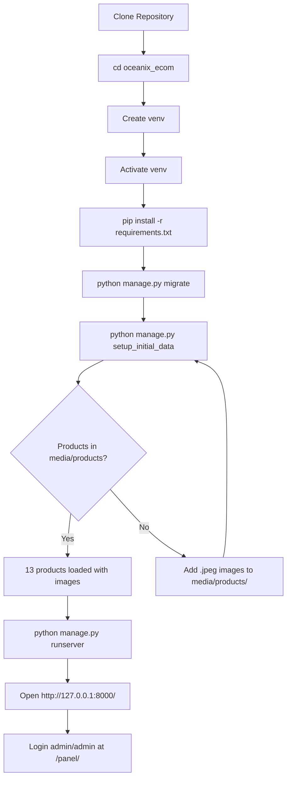
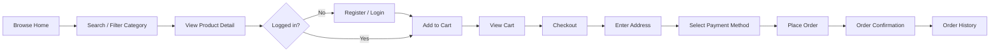
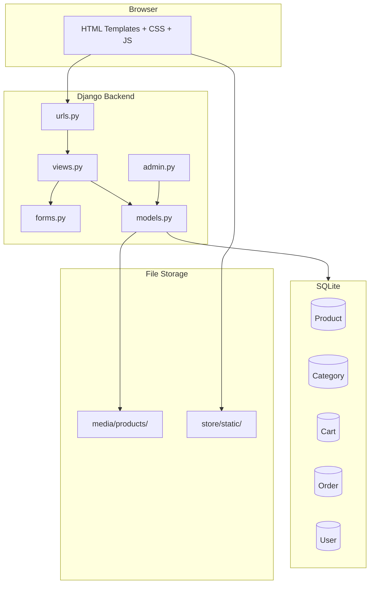
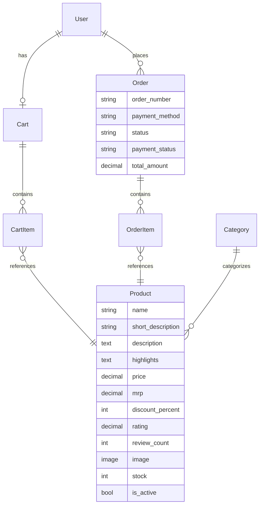

# OCEANIX — Implementation Guide

Complete step-by-step guide to set up, run, and manage the OCEANIX e-commerce platform.

---

## Prerequisites

| Requirement | Version |
|-------------|---------|
| Python | 3.8 or higher |
| pip | Latest |
| Git | Any recent version |
| OS | Windows / macOS / Linux |

---

## Quick Setup (All Commands)

Run these commands in order from the project root:

```bash
# 1. Navigate to Django project
cd oceanix_ecom

# 2. Create virtual environment
python -m venv venv

# 3. Activate virtual environment
venv\Scripts\activate          # Windows
source venv/bin/activate       # macOS / Linux

# 4. Install dependencies
pip install -r requirements.txt

# 5. Apply database migrations
python manage.py migrate

# 6. Create admin user + load products from media folder
python manage.py setup_initial_data

# 7. Start development server
python manage.py runserver
```

### Default Admin Credentials

| Field | Value |
|-------|-------|
| Username | `admin` |
| Password | `admin` |

### Access URLs

| URL | Purpose |
|-----|---------|
| http://127.0.0.1:8000/ | Storefront (shop) |
| http://127.0.0.1:8000/panel/ | Admin Lite Panel |
| http://127.0.0.1:8000/admin/ | Django Admin |
| http://127.0.0.1:8000/login/ | Customer login |

---

## Setup Flowchart



---

## Management Commands Reference

| Command | Description |
|---------|-------------|
| `python manage.py migrate` | Apply database schema changes |
| `python manage.py setup_initial_data` | Create admin user + load media products |
| `python manage.py load_sample_products` | Load text-only sample products (no images) |
| `python manage.py createsuperuser` | Create additional admin manually |
| `python manage.py runserver` | Start development server |
| `python manage.py makemigrations` | Generate new migrations after model changes |
| `python manage.py collectstatic` | Collect static files for production |

### setup_initial_data (Recommended)

This single command does everything needed for first run:

```bash
python manage.py setup_initial_data
```

**What it does:**
1. Creates/updates admin user (`admin` / `admin`) with staff + superuser access
2. Creates product categories (Kitchen, Drinkware, Lunch Boxes, Home Essentials)
3. Reads all images from `media/products/` folder
4. Creates/updates 13 products with names, descriptions, prices, and images

**To add more products:** Place `.jpeg` / `.png` images in `media/products/`, then add product metadata in `store/management/commands/setup_initial_data.py` and re-run the command.

---

## Customer Shopping Flow



### Payment Methods

| Code | Method | Status on Order |
|------|--------|-----------------|
| `cod` | Cash on Delivery | payment_status = pending |
| `upi` | UPI (GPay / PhonePe / Paytm) | payment_status = completed |
| `card` | Credit / Debit Card | payment_status = completed |
| `netbanking` | Net Banking | payment_status = completed |
| `wallet` | Wallet | payment_status = completed |

---

## Admin Panel Flow

```mermaid
flowchart TD
    A[Login as admin] --> B{Choose Panel}
    B --> C[/panel/ Admin Lite]
    B --> D[/admin/ Django Admin]

    C --> E[Dashboard Stats]
    C --> F[Products List]
    C --> G[Orders List]

    F --> H[Add Product]
    F --> I[Edit Product]
    F --> J[Delete Product]

    G --> K[View Order Detail]
    K --> L[Update Status / Payment]

    D --> M[Full DB Management]
```

### Admin Lite Panel URLs

| URL | Action |
|-----|--------|
| `/panel/` | Dashboard |
| `/panel/products/` | List all products |
| `/panel/orders/` | List all orders |
| `/panel/orders/<id>/` | View & update order |
| `/product/add/` | Add new product |
| `/product/<id>/edit/` | Edit product |
| `/product/<id>/delete/` | Delete product |

---

## Project Architecture



---

## Database Models



---

## Folder Structure

```
OCEANIX/
├── README.md                          # Project overview
├── docs/
│   ├── IMPLEMENTATION_GUIDE.md        # This file
│   ├── PROJECT_FLOWCHARTS.md          # Detailed flowcharts
│   └── DOCUMENTATION_INDEX.md         # All docs index
└── oceanix_ecom/
    ├── manage.py
    ├── requirements.txt
    ├── setup.bat / setup.sh           # Auto setup scripts
    ├── oceanix/                       # Django settings
    │   ├── settings.py
    │   └── urls.py
    ├── store/                         # Main app
    │   ├── models.py
    │   ├── views.py
    │   ├── forms.py
    │   ├── admin.py
    │   ├── urls.py
    │   ├── templates/store/           # Storefront templates
    │   ├── templates/store/admin/     # Admin Lite templates
    │   ├── static/css/                # style.css + admin.css
    │   ├── management/commands/
    │   │   ├── setup_initial_data.py  # Admin + media products
    │   │   └── load_sample_products.py
    │   └── migrations/
    └── media/products/                # Product images
```

---

## Windows One-Click Setup

```bash
cd oceanix_ecom
setup.bat
```

## Linux / macOS One-Click Setup

```bash
cd oceanix_ecom
chmod +x setup.sh
./setup.sh
```

---

## Troubleshooting

| Problem | Solution |
|---------|----------|
| `ModuleNotFoundError: django` | Activate venv: `venv\Scripts\activate` |
| Migrations error | Run `python manage.py makemigrations` then `migrate` |
| No products showing | Run `python manage.py setup_initial_data` |
| Can't access /panel/ | Login as `admin` / `admin` (must be staff) |
| Images not loading | Check `media/products/` folder exists with images |
| Port already in use | Run `python manage.py runserver 8001` |

---

## Production Deployment Checklist

- [ ] Change `SECRET_KEY` in `oceanix/settings.py`
- [ ] Set `DEBUG = False`
- [ ] Configure `ALLOWED_HOSTS`
- [ ] Switch to PostgreSQL database
- [ ] Run `python manage.py collectstatic`
- [ ] Set up HTTPS (SSL certificate)
- [ ] Change default admin password
- [ ] Integrate payment gateway (Razorpay / Stripe)

---

## Git Repository

**Repository:** https://github.com/kakkarot23/Oceanix

```bash
git clone https://github.com/kakkarot23/Oceanix.git
cd Oceanix/oceanix_ecom
# Then follow Quick Setup commands above
```
