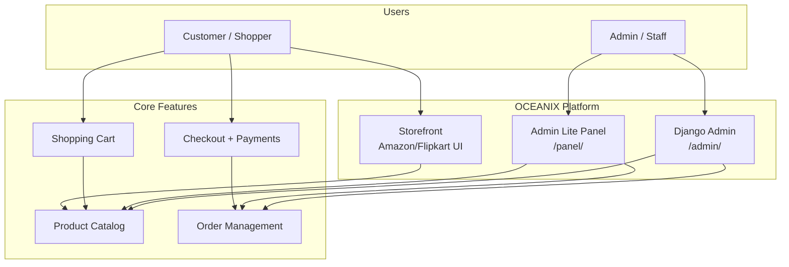
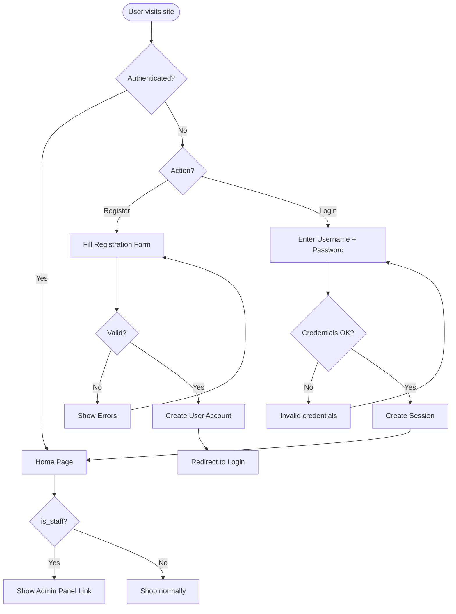
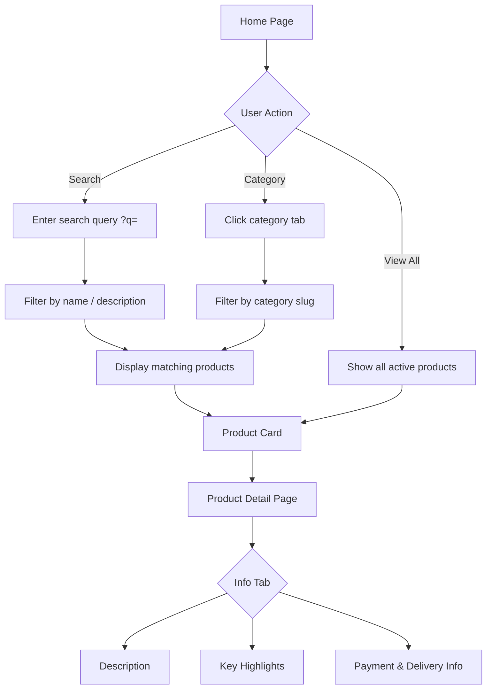
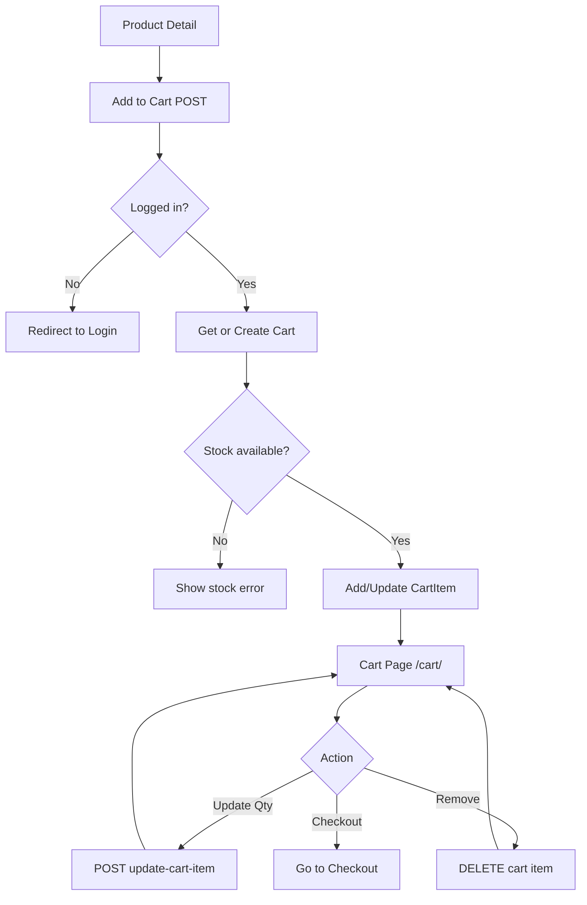
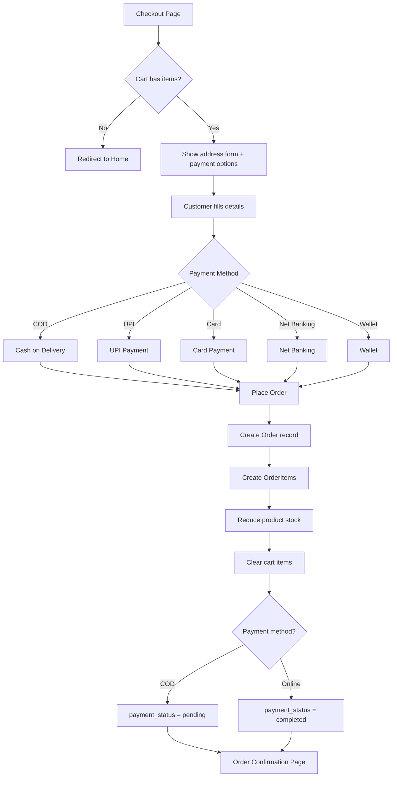
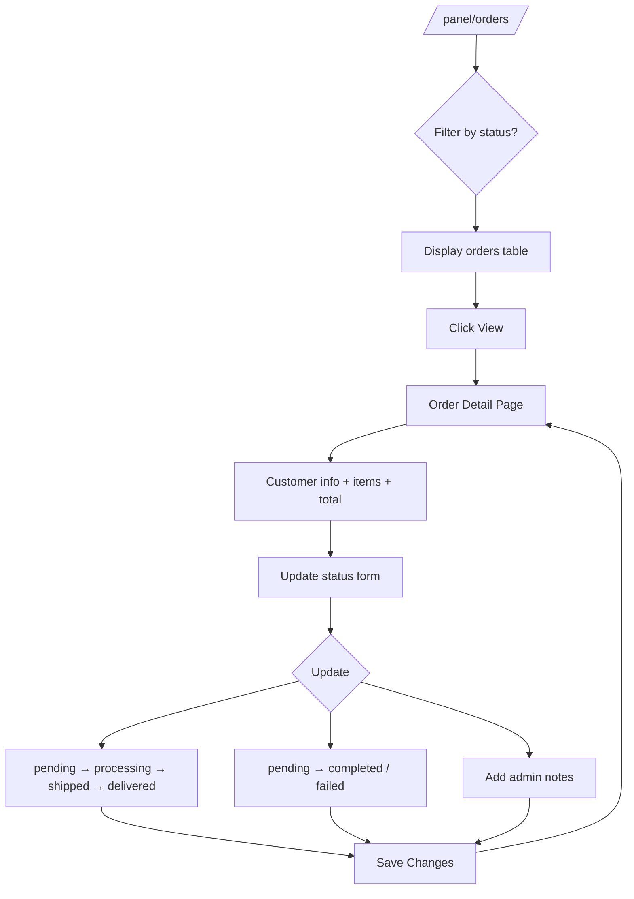
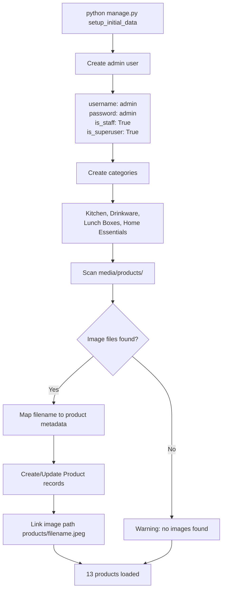
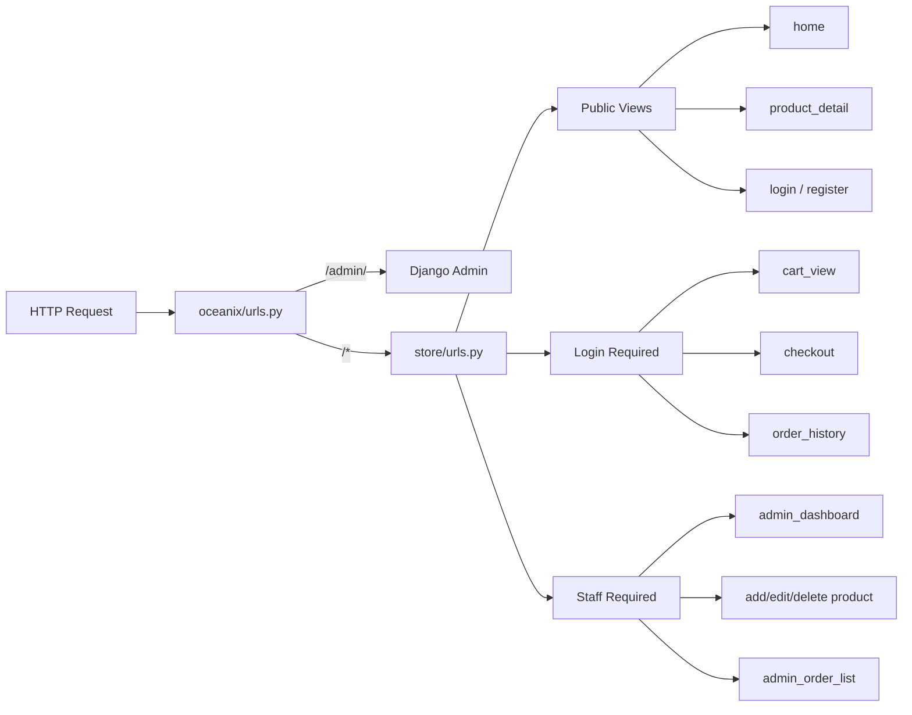
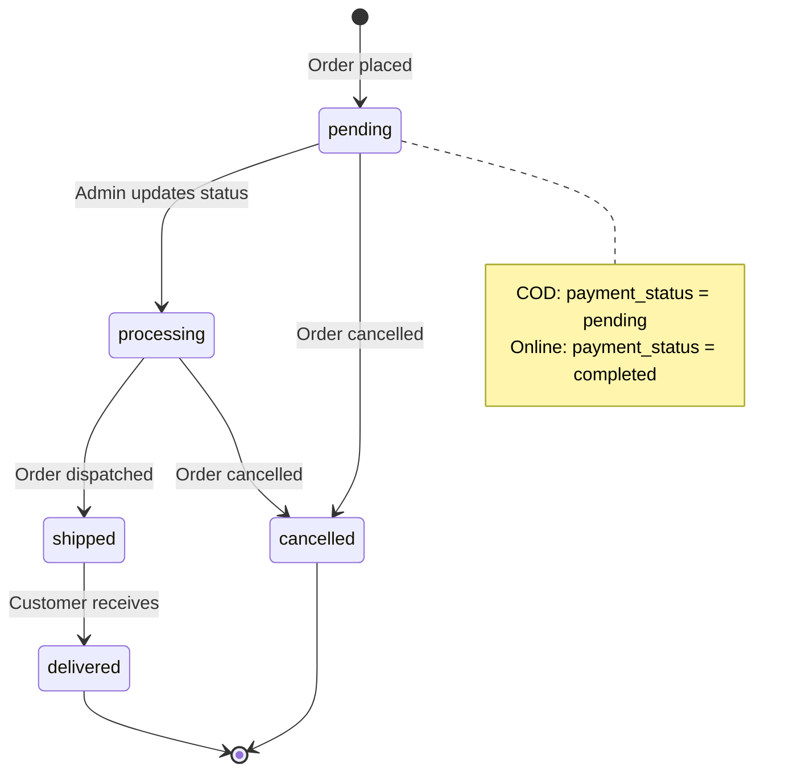

# OCEANIX — Project Flowcharts

Visual diagrams for all major flows in the OCEANIX e-commerce platform.

---

## 1. System Overview



---

## 2. User Registration & Authentication



---

## 3. Product Browsing & Search



---

## 4. Shopping Cart Flow



---

## 5. Checkout & Payment Flow



---

## 6. Admin Lite — Product Management

```mermaid
flowchart TD
    Login[Admin Login<br/>admin / admin] --> Panel[/panel/ Dashboard]

    Panel --> ProdList[/panel/products/]
    Panel --> AddBtn[Add Product]

    ProdList --> Actions{Action}
    Actions -->|View| StoreView[View on storefront]
    Actions -->|Edit| EditForm[Edit Product Form]
    Actions -->|Delete| DeleteConfirm[Confirm Delete]

    AddBtn --> AddForm[Product Form]
    AddForm --> Fields[Fill: name, description,<br/>price, MRP, stock, image, category]
    Fields --> Save[Save Product]
    EditForm --> Save

    Save --> DB[(Database)]
    DeleteConfirm -->|Confirm| RemoveDB[Delete from DB]
    RemoveDB --> ProdList
    DB --> ProdList
```

---

## 7. Admin Lite — Order Management



---

## 8. Data Setup Flow (setup_initial_data)



---

## 9. Request Routing Flow



---

## 10. Order Lifecycle


